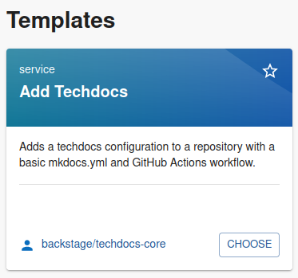

####  Prerequisites
- Your repository exists in the [catalog](/catalog), if not see [Onboarding a new service](/docs/default/component/backstage/getting-started/using-the-catalog/).
# What is Tech Docs?

Tech Docs is a tool for generating documentation for your service. It is based on [MkDocs](https://www.mkdocs.org/) and [Material for MkDocs](https://squidfunk.github.io/mkdocs-material/).
In practice it means that you write your documentation in Markdown in the same repository as your source code, and Tech Docs will generate a static website for you. This can be an alternative to using Confluence.
You can read more about Tech Docs in Backstages [official documentation](https://backstage.io/docs/features/techdocs/).

# How to use it
 
## Add it to your repo
### Use the template

[Add Techdocs](/create/templates/default/add-techdocs) template.



This will create a pull request in your repository that adds the necessary files for Tech Docs to work.

Also consider adding paths-ignore to your other workflows, to avoid building the documentation every time you push to main.
```yaml
on:
  push:
    branches: [ "main" ]
    paths-ignore:
      - 'mkdocs.yml'
      - 'docs/**'
```

### Add it manually
(this is basically the same the [official guide](https://backstage.io/docs/features/techdocs/creating-and-publishing), with some extra tips).

In your `catalog-info.yaml` file add the following annotation.
```yaml
metadata:
  annotations:
    backstage.io/techdocs-ref: dir:.
```

Create `mkdocs.yml` in the repository root directory
```yaml
site_name: a-unique-name-for-your-docs
site_description: An informative description
plugins:
  - techdocs-core
nav:
  - Getting Started: index.md
```

create the folder `docs` and add a file called `index.md` with the following content:
```markdown
---
id: index
title: my index
description: just an index page
---
hei
```

Your file structure should now look like this:
```
your-great-documentation/
  docs/
    index.md
  catalog-info.yaml
  mkdocs.yml
```

## Local development

Run `npx @techdocs/cli serve` in the projects root directory to start a local server. You can now view your documentation at http://localhost:3000.  
If it doesn't start, debug with --verbose.

For inspiration you can look at how Backstage does it on their [demo site](https://demo.backstage.io/docs/default/component/backstage) and [github](https://github.com/backstage/backstage/blob/master/mkdocs.yml)

After pushing to main, your documentation will be available at https://kartverket.dev/docs.

